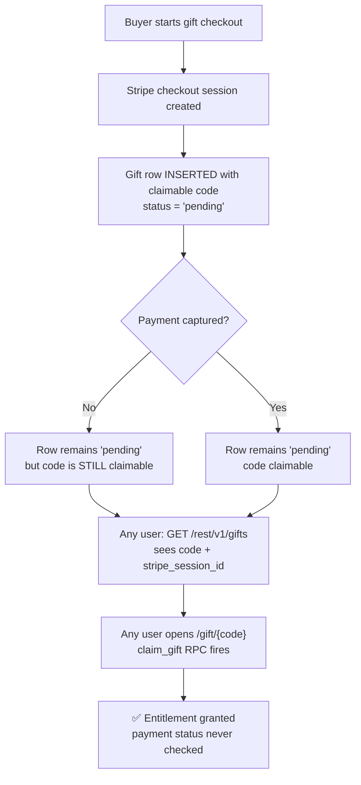

<div align="center">

# 🔓 Disband Gift Exposure & Unvalidated Claim

### Broken Access Control on `public.gifts` allows theft of paid and never-paid gift subscriptions

**Advisory ID:** `DSB-2026-001` *(CVE-format self-disclosure — CNA submission pending)*

[](https://owasp.org/www-community/Top_10/A01_2021-Broken_Access_Control)
[-orange?style=for-the-badge)](https://www.first.org/cvss/calculator/3.1)
[](https://cwe.mitre.org/data/definitions/863.html)
[](#)

**Affected:** [disband.dev](https://www.disband.dev) — Supabase/PostgREST backend, `public.gifts` table + `claim_gift` RPC
**Status:** 🟡 Unpatched at time of writing · disclosed by famefashion · all exposed codes rotated

</div>

---

## 📖 Summary

Disband's gift feature mints a **10-character redeemable code** into `public.gifts` the moment a Stripe *checkout session* is created — **before any payment is captured**. Two independent authorization failures compound on top of that design flaw:

1. **World-readable gift table.** Any registered user can enumerate every gift row — including the redeemable `code`, `buyer_id`, `stripe_session_id`, plan, and payment status — through Supabase's PostgREST API using only the public anon key bundled in the client and a valid account.
2. **Unvalidated claim path.** The `claim_gift` RPC (invoked automatically when a user opens `/gift/{code}`) does not verify that the associated Stripe session was ever paid. Gifts sit at `status = 'pending'` from session creation onward and remain fully claimable.

The combined result: **any registered user can (a) steal paid gifts purchased for other people, and (b) mint themselves free paid entitlements ("Disband Aero") by claiming gifts whose payment was never completed.**

---

## 🎯 Impact

| Vector | Result |
|---|---|
| Read `GET /rest/v1/gifts?claimed_at=is.null` | Full list of unclaimed codes, live, for every user |
| Open `https://www.disband.dev/gift/{code}` | Gift is claimed instantly via the `claim_gift` RPC |
| Claim a `pending` (never-paid) gift | Paid subscription entitlement granted for free — **no Stripe capture required** |

At time of disclosure **20 unclaimed gift rows (~$190 face value, including a 12-month / $89.99 plan) were exposed**, all in `pending` state, several with payment sessions that had not completed capture.

---

## 🧪 Technical Detail

**Environment observed:**

```
Supabase project : mjqbrcabargylrimlafw.supabase.co
Anon key         : ES256/HS256 JWT, shipped in the Next.js client bundle (by design)
Gift code format : 10 chars [a-zA-Z0-9], link form /gift/{code}
Claim RPC        : claim_gift(p_code text)
```

**Table schema exposed to any authenticated role:**

```sql
public.gifts (
  id, code, buyer_id, plan, months, amount_cents,
  stripe_session_id, status, claimed_by, claimed_at, expires_at, created_at
)
```

**The failure chain:**



**Why it's critical:** the code exists and is claimable *before* money exists. Payment validation was assumed to be upstream of redemption; it isn't. The RLS layer that correctly protects every other sensitive table in this application (`moderation_actions`, `official_broadcasts` — GRANT-denied; `messages` — INSERT policy-pinned; cosmetics — ownership-checked) was **never applied to `gifts`**.

---

## 🔬 Proof of Concept

`poc.js` — zero dependencies, Node ≥ 18:

```bash
node poc.js --url https://mjqbrcabargylrimlafw.supabase.co \
            --key <anon-key> \
            --email attacker@example.com --password <password>
```

Observed output (truncated):

```
[*] Authenticated as: <user id>
[*] Unclaimed gifts readable: 20
    XKNDxty9tN  aero  1mo   $8.99   pending  https://www.disband.dev/gift/XKNDxty9tN
    LpAZvYYZwW  aero  12mo  $89.99  pending  https://www.disband.dev/gift/LpAZvYYZwW
    ...18 more...
[!] All claimable. claim_gift does not validate stripe payment status.
```

The PoC is **read-only by design** — it demonstrates the exposure without claiming anything. See [`poc.js`](./poc.js).

---

## 🛠 Remediation

**1. Lock the table (RLS):**

```sql
ALTER TABLE public.gifts ENABLE ROW LEVEL SECURITY;

CREATE POLICY gifts_owner_read ON public.gifts
  FOR SELECT TO authenticated
  USING (buyer_id = auth.uid() OR claimed_by = auth.uid());

-- enforce on write paths:
CREATE POLICY gifts_insert_paid ON public.gifts
  FOR INSERT TO service_role
  WITH CHECK (true);
REVOKE INSERT, UPDATE ON public.gifts FROM authenticated;
```

**2. Validate payment inside the claim path:**

```sql
-- claim_gift must refuse pending capture:
IF EXISTS (
  SELECT 1 FROM public.gifts
  WHERE code = p_code
    AND status <> 'paid'          -- ← the missing check
    FOR UPDATE
) THEN
  RAISE EXCEPTION 'gift_not_paid';
END IF;
```

**3. Fix the lifecycle:** mint the code at **webhook-confirmed payment**, not at session creation. A gift that hasn't been paid for should not exist as a claimable object.

**4. Rotate:** every code issued before the patch is burned — invalidate and reissue.

---

## 📊 CVSS 3.1

```
AV:N / AC:L / PR:L / UI:N / S:U / C:H / I:H / A:N  →  8.1 HIGH
```

`C:H` — full gift inventory + Stripe session IDs readable by any user.
`I:H` — purchase integrity violated: entitlements granted without payment and gifts redirected from intended recipients.

---

## 🗓 Disclosure Timeline

| Date (UTC) | Event |
|---|---|
| 2026-10-03 | Vulnerability identified and confirmed during an authorized red-team engagement against the platform |
| 2026-10-03 | Platform owner notified (self-disclosure); all exposed codes invalidated |
| 2026-10-03 | Advisory + PoC published |

---

<div align="center">

**Authorized disclosure** 

*This advisory and its proof of concept are provided for defensive purposes. The PoC is read-only and does not claim, exhaust, or destroy anything.*

</div>
